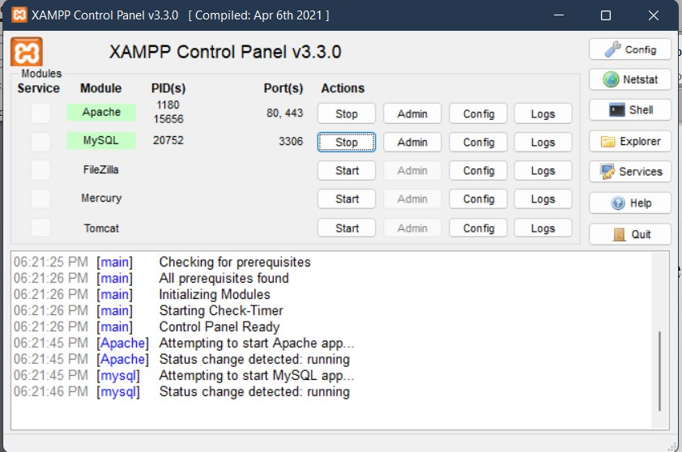
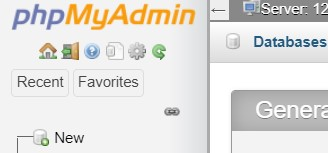
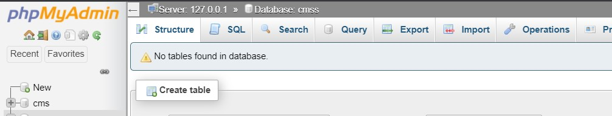
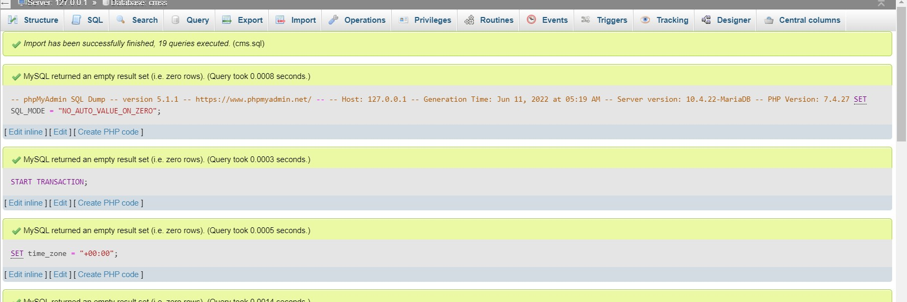

# courierManagmentSystem

	Software requirements:

•	Any browser like chrome or edge

•	Xampp x64 bit

	How to run this system

1.	Setup the Xampp Control Panel 
Then clone this repository and move it in the ‘htdocs’ folder of Xampp (In c drive)

2.	Open Xampp, run Apache server and MySQl

Place this URl in your browsers 
‘http://localhost/phpmyadmin/’
 Or you can just click on the MySQL admin button in Xampp it will open PhPMyAdmin

3.	Import Database 

In PhpMyAdmin, create a new database with name ‘cms’ 
 
 

Then import database
 

Click on ‘import’ and navigate to the htdocs>darcel>database>cms.db

 
That’s all!
Now you can run this application in your browser

User Panel

Simply put http://localhost/darcel/userpanal/login.php in browser

Admin Panel

http://localhost/darcel/Admin /login.php

		How the system works

User panel:

The user of the courier management system will interact with the application through an easy to use log in by use of the web page the home page. The home page contains the dashboard with a clear view of the history of the parcels and branches. Some functions can only be seen by the admin while others the user only. The only part the user cannot see is the total couriers that includes couriers of other users as well. 
The user can only access the parcel, track the parcel and see the reports/status of delivery. 

In this system, Every users has to register themselves first before they can continue.

 

After registration they get a unique id and passwords using which they can login in system 
 

After login they are introduced to a user panel 

 
Here, they can place their couriers and perform other operations like, delete, update and list 

Placing courier 
  
  

  
  
Updating courier 
 

After placing their courier they get a unique number of their courier, that is consignment number, using which they can also track their couriers 

Tracking courier 
 
 

After placing courier a reciept is also provided 

 

So that is all for User panel now lets proceed to Admin panel

	
Admin panel

Administrator of the backend will interact with the application through an easy interface as shown below. The admin can add parcel, update their status and has access to details of every user and courier present in system.

Admin is also given a id and password 
 

Admin panel
The Backend pulls records that have entered by the user and stored in the database and it display the records for manipulation by an administrator of the backend.

 Updating status 
 
 
When a user places their courier, its left to be approved by the company weather they can pick it or not from the address.
•	In transmit means that the courier is picked and out or delivery
•	Deliverd marks the delivery of project

